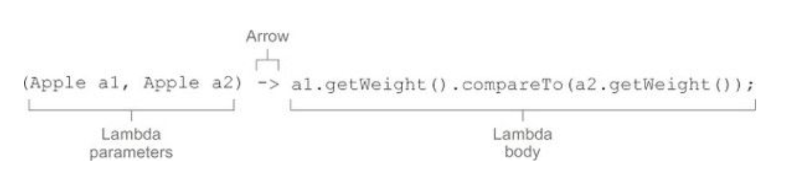

# Java 8 Briefly
The aim of this repository is to show some of the most important improvements in Java 8.

Following topics will be covered:
* [Lambda Expressions](#lambda-expressions)
* [Default Methods](#default-methods)
* [Optionals](#optionals)
* [Streams](#streams)
* [New Date/Time API](#new-date-and-time-api)

## Lambda Expressions
Lambda expression is a concise representation of any anonymous function that can be passed around.

Lambda technically don’t let you do anything that you couldn’t do prior to Java 8. But you no longer have to write clumsy code using anonymous classes.
[Java 7 vs Java 8 example](src/test/java/com/lohika/java8workshop/lambda/LambdaFirstShotTest.java)

* A list of parameters - in this case it mirrors the parameters of the compareTo method of Comparator.
* An arrow - the arrow -> separates the list of parameters from body of the lambda
* The body of the lambda - in this case it’s considered as the lambda’s return value

[Lambdas examples](src/main/java/com/lohika/java8/workshop/lambda/LambdaExamples.java)

[Valid and invalid lambdas](src/main/java/com/lohika/java8/workshop/lambda/ValidInValidLambdas.java)

### Lambda’s syntax rules
* Declaring the types of parameters is optional.
* Using parentheses around a parameters is optional if you have only one parameter.
* Using curly braces is optional (unless you need multiple statements).
* The return keyword is optional if you have simple expression that returns a value.

### Functional Interfaces
It’s an interface that specifies exactly one abstract method (multiple [default method](#default-methods) allowed).
[Example](src/main/java/com/lohika/java8/workshop/lambda/FunctionalInterfaces.java)

The signature of abstract method of a functional interface, is called a **functional descriptor**. So in order to use
different lambda expressions, you need a set of functional interfaces that can describe common function descriptors.

java.util.function introduces several [new FI’s](src/test/java/com/lohika/java8workshop/lambda/FunctionalInterfacesTest.java)

There also primitive specializations: [IntPredicate](https://docs.oracle.com/javase/8/docs/api/java/util/function/IntPredicate.html),
[IntFunction](https://docs.oracle.com/javase/8/docs/api/java/util/function/IntFunction.html),
[IntConsumer](https://docs.oracle.com/javase/8/docs/api/java/util/function/IntConsumer.html), etc…

Lambda doesn’t contain the information about which functional interface it’s implementing.

### Method References
Method references let you reuse existing method definitions and pass them just like lambdas.

Method reference could point to:
* Static methods
* Instance methods
* Methods on particular instance
* Constructors

[Examples](src/test/java/com/lohika/java8workshop/lambda/MethodReferencesTest.java)

### Composing Lambda Expressions
It’s possible to combine several simple lambda expressions to build more complicated ones. Moreover, you can also
compose functions such that the result of one becomes the input of another function.
[Examples](src/test/java/com/lohika/java8workshop/lambda/ComposingLambdasTest.java)

## Default Methods
Default methods allow to provide a default implementation for methods in an interface. This allows to evolve interfaces non intrusively.

With default methods there is a possibility to inherit more that one method with the default implementation with the same signature.

### Resolution Rules
1. Classes always win. A method declaration in the class or a superclass takes priority over any default method declaration.
[Example](src/test/java/com/lohika/java8workshop/defaultmethod/ClassResolutionTest.java)
2. Sub-interfaces win: the method in the most specific default-providing interface is selected.
[Example](src/test/java/com/lohika/java8workshop/defaultmethod/MoreConcreteInterfaceResolutionTest.java)
3. If the choice is still ambiguous, the class has to explicitly select which default method to use.
[Example](src/test/java/com/lohika/java8workshop/defaultmethod/ManualResolutionTest.java)

## Optionals
Java 8 comes with *java.util.Optional<T>* to wrap null return values and avoid NullPointerException (the most common
exception). Inventing of null is called
[a billion-dollar mistake](https://www.lucidchart.com/techblog/2015/08/31/the-worst-mistake-of-computer-science/) by its inventor.

Using Optional can help to design better APIs in which, just by reading the signature of a method, users
can understand the intention of the method.

[Java 7 and earlier example of dealing with nested objects](src/test/java/com/lohika/java8workshop/optional/InsuranceJava7Test.java)

[and Java 8 example](src/test/java/com/lohika/java8workshop/optional/InsuranceOptionalTest.java)

*java.util.Optional* supports methods for filtering, combining and flow controls methods:
[Optional examples](src/test/java/com/lohika/java8workshop/optional/OptionalMethodsTest.java)

## Streams
Streams are an update to Java API that lets you manipulate collections of data in a declarative way.

* Declarative - what to do (Streams).
* Imperative - how to do using loops and ifs (Collections).

[Streams vs Collections](src/test/java/com/lohika/java8workshop/stream/StreamVsCollectionTest.java)

**Stream** - a sequence of elements from a source that supports data processing operations.

Streams:
* Are fixed structures (you can’t add or remove elements) whose elements are computed on demand (computed only when needed).
* Are traversable only once.
* Use internal iteration (the iteration is hidden, user just states what has to be done).

[Examples](src/test/java/com/lohika/java8workshop/stream/StreamsFeaturesTest.java)

Streams have two types of operations:
* Intermediate (filter, map, flatMap, limit, skip, etc…). Those operations allow pipelining. Intermediate operations
don’t perform any processing until terminal operation is invoked.
* Terminal operations (collect, reduce, forEach, count).

Some operations are short-circuiting: a processing stops as soon as a result is found. Those operations are: skip, limit, findFirst, findAny, anyMatch.

Basically, working with streams involves three items:
* A data source.
* A chain of intermediate operations.
* A terminal operation.

Streams examples:
* [Filtering](src/test/java/com/lohika/java8workshop/stream/FilteringTest.java)
* [Slicing](src/test/java/com/lohika/java8workshop/stream/SlicingTest.java)
* [Mapping](src/test/java/com/lohika/java8workshop/stream/MappingTest.java)
* [Finding and Matching](src/test/java/com/lohika/java8workshop/stream/FindingMatchingTest.java)
* [Reducing](src/test/java/com/lohika/java8workshop/stream/ReducingTest.java)
* [Numeric Streams](src/test/java/com/lohika/java8workshop/stream/NumericStreamsTest.java)
* [Building Streams](src/test/java/com/lohika/java8workshop/stream/BuildingStreamsTest.java)
* [Reducing with Collectors](src/test/java/com/lohika/java8workshop/stream/collector/ReducingTest.java)
* [Grouping](src/test/java/com/lohika/java8workshop/stream/collector/GroupingTest.java)
* [Partitioning](src/test/java/com/lohika/java8workshop/stream/collector/PartitioningTest.java)

## New Date and Time API
The old *java.util.Date* class and all other classes used to model date and time in Java before Java 8 have 
many inconsistencies and design flaws, including their mutability and some poorly chosen offsets, default naming.

The new Date/Time Java API integrates many of the Joda-Time features.

The basic DateTime API class hierarchy:

Temporal (specific point of time) [Examples](src/test/java/com/lohika/java8workshop/datetime/TemporalTest.java):
* LocalDate - a plain date without time of day and a timezone.
* LocalTime - time of day without date and a timezone.
* LocalDateTime - time and date without a timezone.
* ZonedDateTime - time, date and timezone.
* Instant - the number of nanoseconds since the UNIX epoch time (00:00:00 Jan 1, 1970 UTC)

TemporalAmount (duration between temporals) [Examples](src/test/java/com/lohika/java8workshop/datetime/TemporalAmountTest.java):
* Duration - an amount of time measured in seconds and nanoseconds.
* Period - an amount of time measured in years, months, and days.

### TemporalAdjusters
Are used for performing more advanced operations, such as adjusting a date to the next Monday, the next working day, or the last day of the month.
In such cases one can pass to an overloaded version of the **with** method with TemporalAdjuster.
[Examples](src/test/java/com/lohika/java8workshop/datetime/TemporalAdjustersTest.java)

### Formatting and Parsing
The base class is DateTimeFormatter. It’s a thread-safe class.
[Examples](src/test/java/com/lohika/java8workshop/datetime/FormattingAndParsingTest.java)

### Working with different time zones
The new java.time.ZoneId class is the replacement for the old java.util.TimeZone. It aims to better shield one from
the complexities related to time zones, such as dealing with Daylight Saving Time.

## Practicing
Imaging there is some list of transactions. Each transaction has: id, description, type, date and total.
To practice covered topics one could solve following tasks:
* [Filter transactions](src/test/java/com/lohika/java8workshop/hometask/Task1.java)
* [Sort transactions](src/test/java/com/lohika/java8workshop/hometask/Task2.java)
* [Calculate transactions total](src/test/java/com/lohika/java8workshop/hometask/Task3.java)
* [Find the most expensive transaction in each category](src/test/java/com/lohika/java8workshop/hometask/Task4.java)
* [Calculate the total count of transactions in each category](src/test/java/com/lohika/java8workshop/hometask/Task5.java)
* [Find the most popular item](src/test/java/com/lohika/java8workshop/hometask/Task6.java)
* [Calculate total amount of transactions for each month](src/test/java/com/lohika/java8workshop/hometask/Task7.java)
